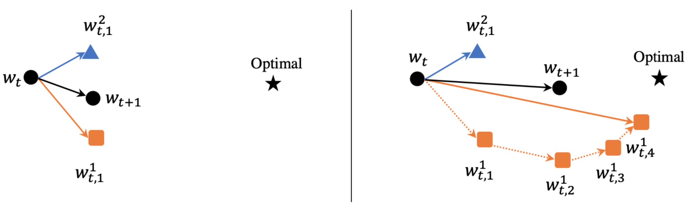

# ESync

This is a MXNet implementation of the ESync algorithm described in the paper "ESync: An Efficient Synchronous Parallel Algorithm for Distributed ML in Heterogeneous Clusters". 

ESync is an efficient synchronous parallel algorithm designed for distributed machine learning tasks in heterogeneous clusters (the clusters may consist of computing devices with different computing capabilities, e.g. CPU, GPU, TPU, FPGA), which takes both the accuracy of [SSGD](https://arxiv.org/pdf/1604.00981.pdf) and training speed of [ASGD](http://papers.nips.cc/paper/4687-large-scale-distributed-deep-networks.pdf), meanwhile takes full advantage of the computing capabilities of the heterogeneous clusters with lowest traffic load. Besides, ESync allows the aggregation operations to be performed in a synchronous manner in heterogeneous clusters, provides users with flexibility in selecting different efficient collective communication algorithms according to the characteristics of tasks and network (e.g. [Parameter Server](https://www.usenix.org/system/files/conference/osdi14/osdi14-paper-li_mu.pdf), [Ring Allreduce](http://research. baidu.com/bringing-hpc-techniques-deep-learning/), [Butterfly](https://link.springer.com/content/pdf/10.1007%2F978-3-540-24685-5_1.pdf), [Binary Blocks](https://link.springer.com/content/pdf/10.1007%2F978-3-540-24685-5_1.pdf)).

# Overview of the ESync Algorithm

# References

[1] [Chen, Jianmin, et al. "Revisiting distributed synchronous SGD." arXiv preprint arXiv:1604.00981 (2016).](https://arxiv.org/pdf/1604.00981.pdf)

[2] [Dean, Jeffrey, et al. "Large scale distributed deep networks." Advances in neural information processing systems. 2012.](http://papers.nips.cc/paper/4687-large-scale-distributed-deep-networks.pdf)

[3] [Li, Mu, et al. "Scaling distributed machine learning with the parameter server." 11th {USENIX} Symposium on Operating Systems Design and Implementation ({OSDI} 14). 2014.](https://www.usenix.org/system/files/conference/osdi14/osdi14-paper-li_mu.pdf)

[4] [Gibiansky, Andrew. "Bringing HPC techniques to deep learning". http://research. baidu.com/bringing-hpc-techniques-deep-learning/, 2017.2.21.](http://research. baidu.com/bringing-hpc-techniques-deep-learning/)

[5] [Rabenseifner, Rolf. "Optimization of collective reduction operations." International Conference on Compu- tational Science, Krakow, Poland, 2004.6.6-6.9.](https://link.springer.com/content/pdf/10.1007%2F978-3-540-24685-5_1.pdf)
