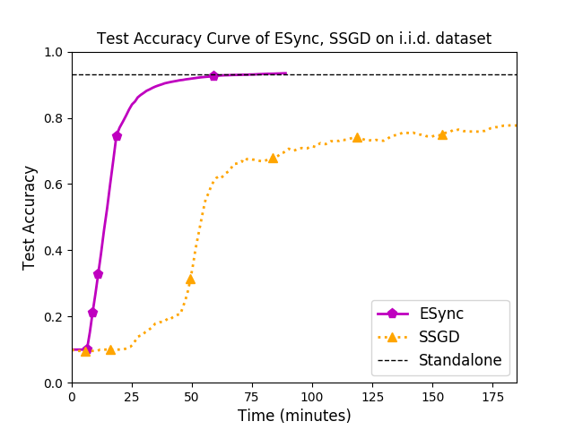

# ESync

This is a MXNet implementation of the ESync algorithm described in the paper "ESync: An Efficient Synchronous Parallel Algorithm for Distributed ML in Heterogeneous Clusters". 

ESync is an efficient synchronous parallel algorithm designed for distributed machine learning tasks in heterogeneous clusters (the clusters may consist of computing devices with different computing capabilities, e.g. CPU, GPU, TPU, FPGA), which:

* takes both the accuracy of [SSGD](https://arxiv.org/pdf/1604.00981.pdf) and training speed of [ASGD](http://papers.nips.cc/paper/4687-large-scale-distributed-deep-networks.pdf);
* takes full advantage of the computing capabilities of the heterogeneous clusters with lowest traffic load. 
* allows the aggregation operations to be performed in a synchronous manner in heterogeneous clusters, and provides users with flexibility in selecting different collective communication algorithms according to the characteristics of tasks and network (e.g. [Parameter Server](https://www.usenix.org/system/files/conference/osdi14/osdi14-paper-li_mu.pdf), [Ring Allreduce](http://research.baidu.com/bringing-hpc-techniques-deep-learning/), [Butterfly](https://link.springer.com/content/pdf/10.1007%2F978-3-540-24685-5_1.pdf), [Binary Blocks](https://link.springer.com/content/pdf/10.1007%2F978-3-540-24685-5_1.pdf)).

# Usage

## Prerequisites

* python == 3.6
* mxnet == 1.4.0 
* numpy == 1.16.2
* argparse == 1.4.0
* matplotlib == 3.0.3

> Note: MXNet should be compiled with the build flag **USE\_DIST\_KVSTORE=1** to support distributed training. See [Distributed Training in MXNet](https://mxnet.incubator.apache.org/versions/master/faq/distributed_training.html) for more details.

## Hyper Parameters

Parameter Name | Flag | Type | Default Value |  Description 
:-:|:-:|:-:|:-:|:--
**learning\_rate** | -l | float | 0.001 |  Set **learning\_rate** when **mode** is *sync*, *async* or *local*. This parameter is used in the optimizer (e.g. SSGD, ASGD) to scale the gradient.
**local\_lr** | -ll | float | 0.001 | Set **local\_lr** when **mode** is *esync*. This parameter is used in the local optimizer (e.g. SGD, Momentum, Adam) to scale the gradient.
**global\_lr** | -gl | float | 1.0 | Set **global\_lr** when **mode** is *esync*. This parameter is used in the global aggregation operation to scale the aggregated model updates and can be simply set to 1.0.
**batch\_size** | -b | int | 64 | The number of samples processed in an iteration on each device.
**data\_dir**| -dd | string | /home/lizh/ESync/data | Path to the data files. Include a folder named *fashion-mnist*, which contains *t10k-images-idx3-ubyte.gz*, *t10k-labels-idx1-ubyte.gz*, *train-images-idx3-ubyte.gz*, *train-labels-idx1-ubyte.gz*. The Fashion-MNIST dataset is available on [Github](https://github.com/zalandoresearch/fashion-mnist).
**gpu** | -g | int | 0 | The ID of GPU used for training. We default to using only one GPU for each process in the current version, i.e. only one integer is allowed.
**cpu** | -c | bool | *False* | Default to training on GPU 0 (set by the option **gpu**), set **cpu** to *True* to support training on CPU.
**network** | -n | string | *resnet18-v1* | The network used to evaluate the performance of *esync*, *sync* and *async*. We support [*alexnet*, *resnet18-v1*, *resnet50-v1*, *resnet50-v2*, *mobilenet-v1*, *mobilenet-v2*, *inception-v3*] in the current version.
**log\_dir** | -ld | string | /home/lizh/ESync/logs | Path to save the logs. The folder named *logs* will be created automatically at the specified path, and it will be emptied during initialization. The Measure module will create subfolders "{device\_name}{device\_id}" and save log files "iter-{iter\_num}.txt" in these subfolders.
**eval\_duration** | -e | int | 1 | Interval for model evaluation, default to evaluating the model in each communication round. We recommend evaluating the model on devices with strong computing capability.
**mode** | -m | string | *esync* | Support [*esync*, *sync*, *async*, *local*]. Set **mode** to *local* to train the model on single device.
**split\_by\_class** | -s | bool | *False* | Default to allocating datasets using the uniform random sampling. Set **split\_by\_class** to *True* to allocate specific classes of samples to each device, for example, allocate samples with labels 0\~4 to device 0 and samples with labels 5\~9 to device 1.
**state\_server\_ip** | -ip | string | 10.1.1.34 | The IP of State Server.
**state\_server\_port** | -port | string | 10010 | The port of State Server.

> Note: The default values can be modified through [config.py](https://github.com/Lizonghang/ESync/blob/master/config.py).

> Note: DO NOT run multiple processes that use the same device on each server, otherwise the log files will be overwritten.

## Start Training

### Training on a single device

```
python main.py -m local -n resnet18-v1 -g 0 -e 100
```

In the above command, we train the *resnet18-v1* model on a single device (GPU 0) and evaluate the model every 100 iterations. This mode only prints test accuracy at the terminal without recording log files.

### Distributed Training

Suppose we have two servers, cloud1 (IP: 10.1.1.29) and cloud3 (IP: 10.1.1.33), and each with two GPUs. We take GPU 0, GPU 1 and CPU of these servers as separate workers, and obtain a small-scale heterogeneous cluster with 6 workers. In addition, we take an extra server cloud2 (IP: 10.1.1.34) to take the role of Parameter Server, Scheduler and State Server.

**Step 1: Start the State Server** 

> Note: This step can be ignored if **mode** is not *esync*.

The state server is used in ESync algorithm to assign the number of local iterations for each device automatically. The main idea is that, when the slowest device completes computations, other devices have completed local iterations as many times as possible.

Run the following commands on cloud2 to start the state server:

```
> cd /path/to/ESync/SimpleStateServer
> nohup python manage.py runserver 0.0.0.0:10010 > /dev/null &
```

The state server will listen on port 10010 in the background to wait for the queries from workers.

**Step 2: Start the Schduler**

Run the following commands on cloud2 (IP: 10.1.1.34) to start the scheduler:

```
> cd /path/to/ESync
> DMLC_ROLE=scheduler DMLC_PS_ROOT_URI=10.1.1.34 DMLC_PS_ROOT_PORT=9091 DMLC_NUM_SERVER=1 \
  DMLC_NUM_WORKER=6 PS_VERBOSE=1 DMLC_INTERFACE=eno2 \
  nohup python main.py -c True -m esync > scheduler.log &
```

We start the scheduler on cloud2 and listen on port 9091 to wait for the messages (e.g. register, heartbeat) from workers. We specify the scheduler to use CPU to avoid errors that no GPU resources available, and specify **mode** to *esync* to run ESync algorithm (Set **mode** to *sync* or *async* to run SSGD or ASGD).

> Note: Specify the network interface manually through **DMLC_INTERFACE** if multiple network interfaces exist on the server, otherwise, we may fail to access other servers.

> Note: Set **PS\_VERBOSE** to 1, and check the log of PS-LITE to troubleshoot errors.

**Step 3: Start the Server**

Run the following commands on cloud2 (IP: 10.1.1.34) to start the parameter server:

```
> DMLC_ROLE=server DMLC_PS_ROOT_URI=10.1.1.34 DMLC_PS_ROOT_PORT=9091 DMLC_NUM_SERVER=1 \
  DMLC_NUM_WORKER=6 PS_VERBOSE=1 DMLC_INTERFACE=eno2 \
  nohup python main.py -c True -m esync > server.log &
```

The parameter server will create a TCP connection to the scheduler and complete registration automatically by specifying **DMLC\_PS\_ROOT\_URI** and **DMLC\_PS\_ROOT\_PORT** (the same as workers). The aggregation operations will be performed on GPU if **cpu** is set to *False*.

**Step 4: Start the Workers**

Run the following commands on cloud1 (IP: 10.1.1.29) and cloud3 (IP: 10.1.1.33) to start the workers:

```
> DMLC_ROLE=worker DMLC_PS_ROOT_URI=10.1.1.34 DMLC_PS_ROOT_PORT=9091 DMLC_NUM_SERVER=1 \
  DMLC_NUM_WORKER=6 PS_VERBOSE=1 DMLC_INTERFACE=eno2 \
  nohup python main.py -g 0 -m esync -n resnet18-v1 > worker_gpu_0.log &
  
> DMLC_ROLE=worker DMLC_PS_ROOT_URI=10.1.1.34 DMLC_PS_ROOT_PORT=9091 DMLC_NUM_SERVER=1 \
  DMLC_NUM_WORKER=6 PS_VERBOSE=1 DMLC_INTERFACE=eno2 \
  nohup python main.py -g 1 -m esync -n resnet18-v1 > worker_gpu_1.log &
  
> DMLC_ROLE=worker DMLC_PS_ROOT_URI=10.1.1.34 DMLC_PS_ROOT_PORT=9091 DMLC_NUM_SERVER=1 \
  DMLC_NUM_WORKER=6 PS_VERBOSE=1 DMLC_INTERFACE=eno2 \
  nohup python main.py -c 1 -m esync -n resnet18-v1 > worker_cpu.log &
```

We start workers on GPU 0, GPU 1 and CPU respectively on both cloud1 and cloud3, and obtain a small-scale heterogeneous cluster with 6 workers, 1 parameter server, 1 scheduler and 1 state server (optional). In the example above, we run a distributed machine learning task to train the ResNet18-v1 model based on ESync algorithm, and the evaluation operations will be performed on device with rank 0.

## Log Visualization

To visualize the log data, we should collect the log files on cloud1 and cloud3 manually. Take the ResNet18-v1 model and ESync algorithm as an example, we create a new folder named *resnet18-v1* with a subfolder named *esync*, and rename the log folders as their host names, the structure is as follows:

```
resnet18-v1
    |── esync
          |── cloud1
                |── cpu
                |── gpu0
                |── gpu1
          |── cloud3
                |── cpu
                |── gpu0
                |── gpu1
```

Pre-trained log files are available at [lfs/logs.zip](https://github.com/Lizonghang/ESync/blob/master/lfs/logs.zip), which contains the logs generated by several classic models (AlexNet, Inception-v3, MobileNet-v1, ResNet18-v1, ResNet50-v1, ResNet50-v2) and four training modes (ESync, Sync (i.e. SSGD), Async (i.e. ASGD, provided only in *resnet18-v1*), Standalone). In addition, we also provide the test accuracy curve of ESync and Sync in the *results* folders.

### Log Summary

In this section, we summarize the large number of *iter-x.txt* files into a JSON file, which includes statistical data on each device and is used for visualizing the logs.

Run the following commands to summarize the logs:

```
> python summary.py -b /path/to/logs -n resnet18-v1 -m esync
```

The script [summary.py](https://github.com/Lizonghang/ESync/blob/master/summary.py) will read files from /path/to/logs/resnet18-v1/esync and generate a JSON file named *ESync.json* there.

### Visualization

#### ResNet18-v1

Run the following commands to visualize the logs of *resnet18-v1*:

```
> python drawer.py -b /path/to/logs -n resnet18-v1
```

The script [drawer.py](https://github.com/Lizonghang/ESync/blob/master/drawer.py) will read data from:

* /path/to/logs/resnet18-v1/esync/ESync.json
* /path/to/logs/resnet18-v1/sync/Sync.json
* /path/to/logs/resnet18-v1/async/Async.json (optional)
* /path/to/logs/resnet18-v1/esync-niid/ESync-Non-IID.json (optional)
* /path/to/logs/resnet18-v1/sync-niid/Sync-Non-IID.json (optional)
* /path/to/logs/resnet18-v1/async-niid/Async-Non-IID.json (optional)

and draw the following figures:

1\. Test Accuracy Curve of ESync, Sync, Async on i.i.d. Fashion-MNIST dataset;

2\. Test Accuracy Curve of ESync, Sync, Async on non-i.i.d. Fashion-MNIST dataset;


3\. Data Throughput of ESync, Sync, Async;

4\. Traffic Load of ESync, Sync, Async;


5\. Communication Time Ratio of ESync, Sync, Async.


> Note: We deploy the parameter server on cloud1 in this version, which reduces the communication delay of devices on cloud1, and we have solved this problem in the paper.

> Note: The dotted lines in Fig. 1 and Fig. 2 draw the test accuracy when training on a single device. The test accuracy of standalone training is available in the file *standalone.txt* and should be specified at lines 260 and 272.

> Note: Since only device with rank 0 records the values of test accuracy, we need to ensure that the variable *config* at lines 258 and 270 specifies the correct devices. We list the *config* for each model in our experiments as follows:

* AlexNet: <code>("cloud3", "gpu1"), ("cloud3", "gpu1"), (null, null)</code>;
* Inception-v3: <code>("cloud3", "gpu0"), ("cloud3", "gpu0"), (null, null)</code>;
* MobileNet-v1: <code>("cloud3", "gpu1"), ("cloud3", "gpu0"), (null, null)</code>;
* ResNet18-v1: <code>("cloud3", "gpu0"), ("cloud3", "gpu1"), ("cloud3", "gpu0")</code>;
* ResNet50-v1: <code>("cloud3", "gpu0"), ("cloud3", "gpu1"), (null, null)</code>;
* ResNet50-v2: <code>("cloud3", "gpu0"), ("cloud3", "gpu1"), (null, null)</code>;

#### Other Models



&emsp;&emsp;&emsp;&emsp;&emsp;&emsp;&emsp; Test Accuracy of AlexNet
&emsp;&emsp;&emsp;&emsp;&emsp;&emsp;&emsp;&emsp;&emsp;&emsp;&emsp;&emsp; Test Accuracy of Inception-v3

# References

[[1] Chen, Jianmin, et al. "Revisiting distributed synchronous SGD." arXiv preprint arXiv:1604.00981 (2016).](https://arxiv.org/pdf/1604.00981.pdf)

[[2] Dean, Jeffrey, et al. "Large scale distributed deep networks." Advances in neural information processing systems. 2012.](http://papers.nips.cc/paper/4687-large-scale-distributed-deep-networks.pdf)

[[3] Li, Mu, et al. "Scaling distributed machine learning with the parameter server." 11th {USENIX} Symposium on Operating Systems Design and Implementation ({OSDI} 14). 2014.](https://www.usenix.org/system/files/conference/osdi14/osdi14-paper-li_mu.pdf)

[[4] Gibiansky, Andrew. "Bringing HPC techniques to deep learning". http://research.baidu.com/bringing-hpc-techniques-deep-learning/, 2017.2.21.](http://research.baidu.com/bringing-hpc-techniques-deep-learning/)

[[5] Rabenseifner, Rolf. "Optimization of collective reduction operations." International Conference on Compu- tational Science, Krakow, Poland, 2004.6.6-6.9.](https://link.springer.com/content/pdf/10.1007%2F978-3-540-24685-5_1.pdf)
